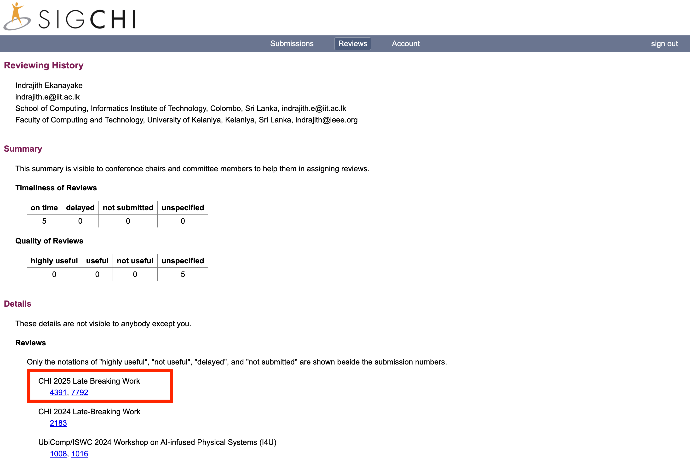

The <a href="https://dl.acm.org/conference/chi" target="_blank">ACM Conference on Human Factors in Computing Systems (CHI)</a> is generally considered the most prestigious(<a href="https://scholar.google.com/citations?hl=en&view_op=list_hcore&venue=6NNnGOq9_mAJ.2023" target="_blank">h5-index 122</a>) in the field of human-computer interaction. It is hosted by ACM SIGCHI, the Special Interest Group on Computer-Human Interaction. CHI has been held annually since 1982 and attracts thousands of international attendees.

Also its noteworthy <a href="https://kenhinckley.wordpress.com/wp-content/uploads/2023/05/excellence-in-reviews-mobilehci-2015-web-site.pdf" target="_blank">This penned essay</a> from <a href="https://x.com/ken_hinckley" target="_blank">Dr ken_hinckley</a> is my mantra for reviewing a paper. 

**Number of Papers reviewed:** 2 

