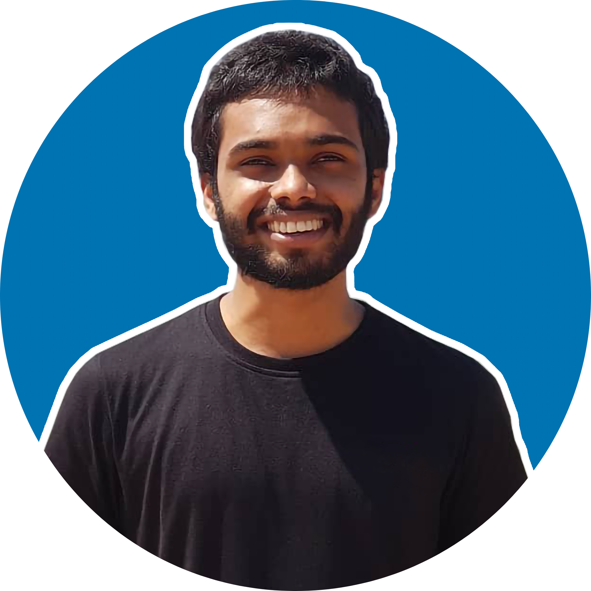
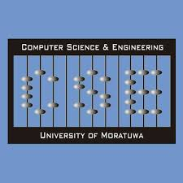
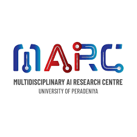
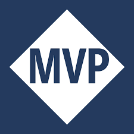
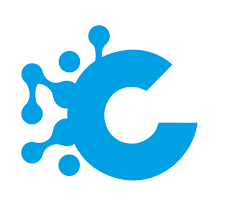
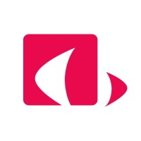

I'm currently working full-time in academia. In day time I work full time at <a href="https://tinyurl.com/4vnsku46" target="_blank">Informatics Institute of Technology (IIT) School of Computing</a> as a lecturer. At night I'm volunteer research assistant at  
1. <a href="https://aitr-lab.github.io/" target="_blank">AITR Lab, Department of Computer Science and Engineering, University of Moratuwa.</a>  
2. <a href="https://marcuop.netlify.app/" target="_blank">MARC Lab, Department of Computer Engineering at University of Peradeniya</a>.

I do research in the areas of HCI, Computer Vision (Bio Med), 3D Computer Vision, Distributed Systems, and Multi Objective Reinforcement Learning. My current advisors are <a href="https://web2.ee.pdn.ac.lk/people/RoshanG" target="_blank">Prof. Roshan Godaliyadda</a>, <a href="https://federation.edu.au/research/find-an-expert/peter-vamplew" target="_blank">Prof. Peter Vamplew</a>, and <a href="https://thanuj.lk/" target="_blank">Dr. Thanuja Ambegoda</a>

From 2022 - 2024, I worked at <a href="https://codification.io/" target="_blank">Codification</a>, as a Consultant Platform Engineer. Previously I have also worked <a href="https://ou.ac.lk/electrical-and-comp-engi/" target="_blank">Open University (FT)</a>, <a href="https://www.nsbm.ac.lk/faculty-of-computing/" target="_blank">NSBM Green University (FT)</a>, <a href="https://fct.kln.ac.lk/" target="_blank">University of Kelaniya (PT)</a>, and <a href="https://www.iit.ac.lk/computing/" target="_blank">Informatics Institute of Technology (PT)</a> as a Lecturer. I'm also a recipient of the <a href="https://mvp.microsoft.com/en-US/MVP/profile/a25fdb68-34b6-4106-a247-09ac2caffed4" target="_blank">Most Valuable Professional(MVP) Award</a> from Microsoft.

I have an MSc in Big Data Analytics from <a href="https://www.rgu.ac.uk/" target="_blank">Robert Gordon University, UK</a>, where I did research with <a href="https://www.res.cmb.ac.lk/statistics/sameera-viswakula/" target="_blank">Dr Sameera Viswakula's</a> lab. I have an MBA from <a href="https://www.pim.sjp.ac.lk/" target="_blank">PIM, University of Sri Jayewardenepura</a>, where I did research with Dr Samantha Rathnayake. I also have a BSc(1st) in Software Engineering from <a href="https://www.plymouth.ac.uk/" target="_blank">University of Plymouth</a>, where I worked with <a href="https://www.nsbm.ac.lk/staff/dr-rasika-ranaweera/" target="_blank">Dr Rasika Ranaweera's</a> lab.

<a href="https://mailhide.io/e/D81GvwHs" target="_blank">Email</a> &nbsp;/&nbsp; <a href="https://github.com/indrajithekanayake" target="_blank">GitHub</a> &nbsp;/&nbsp; <a href="https://scholar.google.com/citations?user=idLLQh4AAAAJ&hl=en" target="_blank">Google Scholar</a> &nbsp;/&nbsp; <a href="https://www.linkedin.com/in/indrajithek" target="_blank">LinkedIn</a>

<h4 style="margin: 0; color: #666; font-size: 14px; font-weight: 600;">Current Affiliations</h4>

<a href="https://www.iit.ac.lk/computing/" target="_blank" style="text-decoration: none;">

</a>
<a href="https://aitr-lab.github.io/" target="_blank" style="text-decoration: none;">

</a>
<a href="https://marcuop.netlify.app/" target="_blank" style="text-decoration: none;">

</a>
<a href="https://mvp.microsoft.com/en-US/MVP/profile/a25fdb68-34b6-4106-a247-09ac2caffed4" target="_blank" style="text-decoration: none;">

</a>

<h4 style="margin: 0; color: #666; font-size: 14px; font-weight: 600;">Previous Affiliations</h4>

<a href="https://codification.io/" target="_blank" style="text-decoration: none;">

</a>
<a href="https://ou.ac.lk/" target="_blank" style="text-decoration: none;">

</a>
<a href="https://www.nsbm.ac.lk/faculty-of-computing/" target="_blank" style="text-decoration: none;">

</a>
<a href="https://fct.kln.ac.lk/" target="_blank" style="text-decoration: none;">

</a>

<a href="https://www.creativesoftware.com/" target="_blank" style="text-decoration: none;">

</a>

 
<!-- Journal proceedings section start -->

Journal Publications

2025

- L. B. Jayasooriya, N. C. Jayasinghe, I. Ekanayake, and D. P. Rangoda, “[[Perceived Tendencies of Skilled Migration Amidst the Economic Crisis in Sri Lanka: A Case Study of the Education Sector]],” _Migration and Development_, 2025, Art. no. 21632324251343691.

<!-- Conference proceedings section start -->

Indexed Conference Proceedings

2025

- C. Wanigasooriya and I. Ekanayake, “NimbusGuard: A Novel Framework for Proactive Kubernetes Autoscaling Using Deep Q-Networks,” 2025, accepted and to be presented in 40th International Conference on Information Networking (ICOIN). IEEE.
- S. De Alwis and I. Ekanayake, “Explainability, risk modeling, and segmentation based customer churn analytics for personalized retention in e-commerce,” _arXiv_ preprint arXiv:2510.11604 [cs.AI], 2025. [Online]. Available: [https://arxiv.org/abs/2510.11604](https://arxiv.org/abs/2510.11604)
- K. Gunathilake and I. Ekanayake, “[[K8s pro sentinel Extend secret security in kubernetes cluster]]” in _2024 9th International Conference on Information Technology Research (ICITR)_, 2024, pp. 1–5, doi: 10.1109/ICITR64794.2024.10857769.
- T. Mohomed and I. Ekanayake, "[[ARGO-SLSA Software Supply Chain Security in Argo Workflows]]," _2025 Moratuwa Engineering Research Conference (MERCon)_, Moratuwa, Sri Lanka, 2025, pp. 245-250, doi: 10.1109/MERCon67903.2025.11217128.

2023

- **I. Ekanayake**, J. Warnakula and S. Viswakula, "[[Reverse Engineering Piping and Instrumentation Drawings A Deep Learning Approach]]" 2023 International Conference on Power, Instrumentation, Control and Computing (PICC), Thrissur, India, 2023, pp. 1-4, doi: 10.1109/PICC57976.2023.10142454.
- **I. Ekanayake** and R. Ranaweera, "Augmented reality to improve motor functions and cognitive abilities of early childhood education" ACM SIGCHI Winter School – South Asia, 2023, pp. 1-4.

2022

- **I. Ekanayake** and S. Gayanika, "[[Data Visualization Using Augmented Reality for Education A Systematic Review,]]" 2022 7th International Conference on Business and Industrial Research (ICBIR), Bangkok, Thailand, 2022, pp. 533-537, doi: 10.1109/ICBIR54589.2022.9786403.

<!-- Conference proceedings section end -->

<!-- Conference review section start -->

Conference Review Committees

2025

- [[conference review/2025/Late Braking Work ACM Conference on Human Factors in Computing Systems (CHI)|Late Braking Work ACM Conference on Human Factors in Computing Systems (CHI)]]
- [[IEEE 19th International Conference on Industrial and Information Systems(ICIIS)]]
- [[IEEE 10th International Conference on Advances in Technology and Computing (ICATC)]]

2024

- [[conference review/2024/Late Braking Work ACM Conference on Human Factors in Computing Systems (CHI)|Late Braking Work ACM Conference on Human Factors in Computing Systems (CHI)]]
- [[Workshop Interpretable, Inclusive, and Immersive Interaction for Ubiquitous AI-infused Physical Systems at UbiComp ISWC 2024]]
- [[Workshop HCI for User Wellbeing and Peace at International Conference on Architecture and Design (ICAD 2024)]]

<!-- Conference review section end -->

<!-- Talks and presentations section start -->

Invited Talks and Presentations

> [!note]
> Wants to invite me for a physical/ online session? I'm open for 1 session every month. Please fill out this [[Form for Speaking Engagements | Form]] to share your interest

2025

- [[Potential Research in Cloud Computing, Cybersecurity, Other SE domains]]

2024

- [[Deploying Microservice Application with Azure Kubernetes Service]]
- [[Professional Certifications in Career Advancement]]
- [[Kubernetes AI Toolchain Operator (Kaito)]]
- [[Opportunities and Challenges in Big Data Research]]
- [[Gave a voice cut for a documentary by 2nd Year Students Uva Wellassa University]]

2023

- [[Judge - Nimi Shark Tank]]
- [[Run Machine Learning Workloads on Apache Spark]]
- [[Deploying web applications on Microsoft Azure]]
- [[Host web apps with GitHub Pages technical workshop]]
- [[Mentor IEEE VoLT Program]]
- [[Introduction to Competitive Programming]]
- [[Road to Success]]
- [[Podcast LinkedIn and making Connections]]

2022

- [[Awareness sessions on competitive programming - IEEEXtreme10.0 | Awareness sessions on competitive programming - IEEEXtreme16.0]]
- [[Content Creating to Double your value]]
- [[Guest Speech, Generation Z webinar]]
- [[Getting started with DevOps]]
- [[Introductory session for Google CodeJam]]
- [[Invited speech - Wycherley International School]]
- [[Podcast Difference between teaching in Academia Vs Industry]]
- [[Workshop on Python programming]]

2021

- [[Awareness sessions on competitive programming - IEEEXtreme10.0]]
- [[Awareness Session series on Competitive Programming]]
- [[Two days Algorithms and Data Structures workshop - Codesolveur]]
- [[Guest Speech - IEEE Student Branch AGM]]
- [[Keynote at the inauguration of Microsoft Learn Student Club]]
- [[Two days Machine Learning Workshop]]

2020

- [[Will Big Data Make Data Warehouse Obsolete]]

