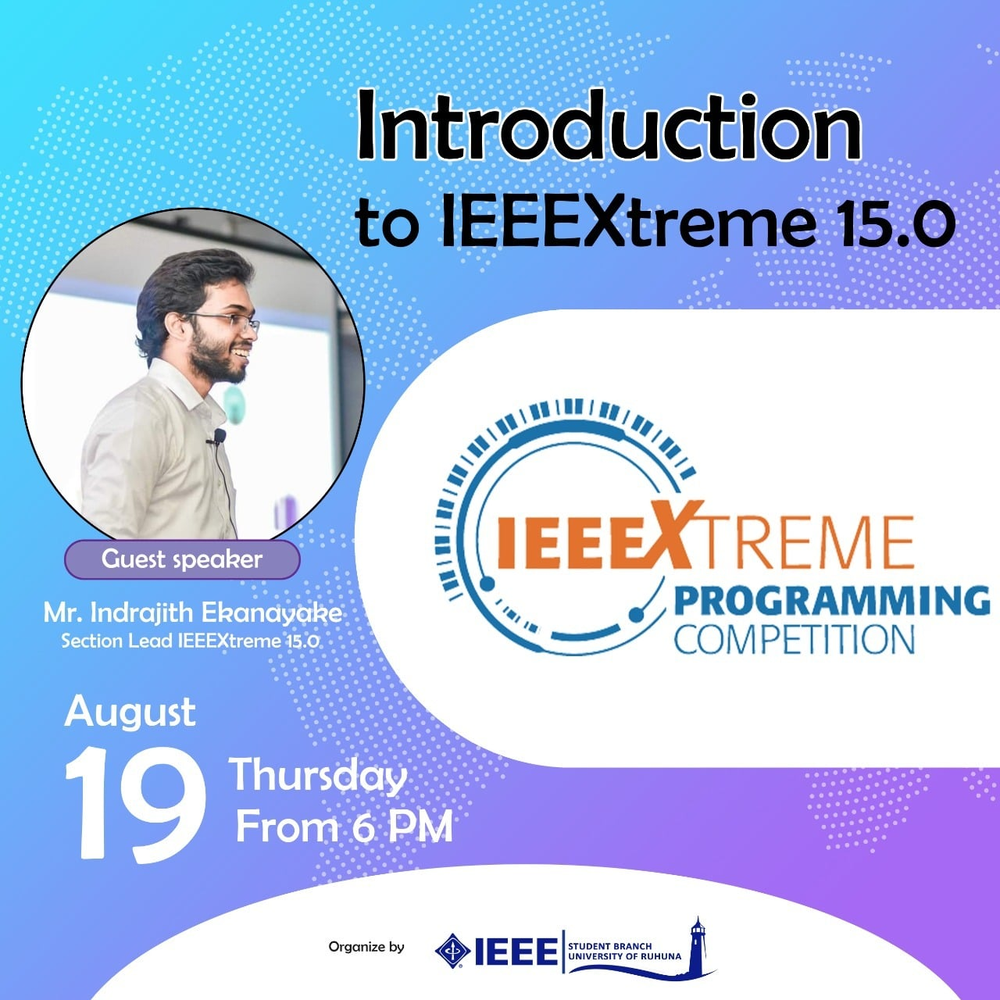
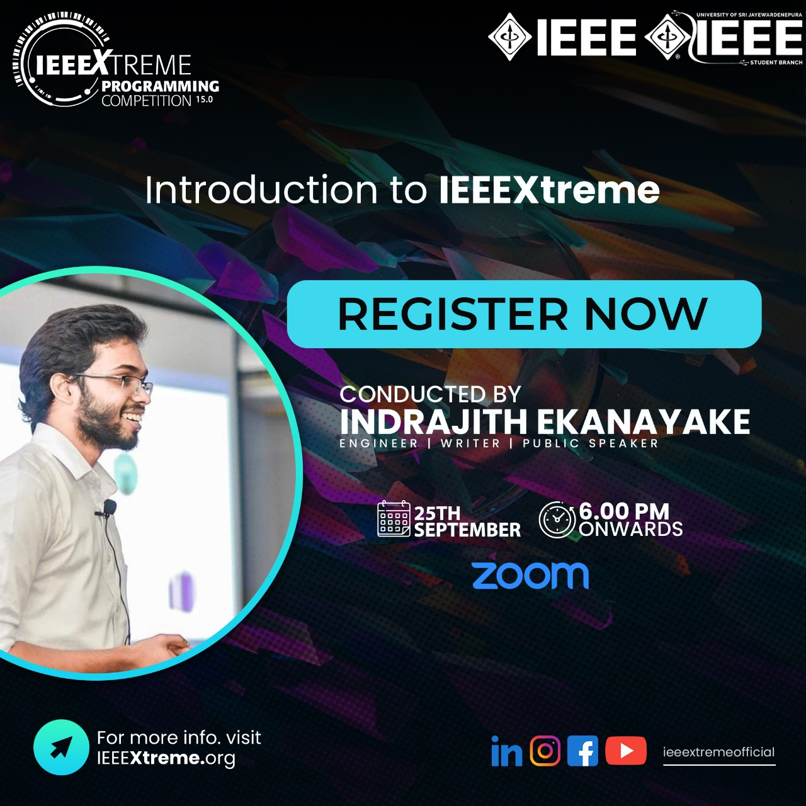
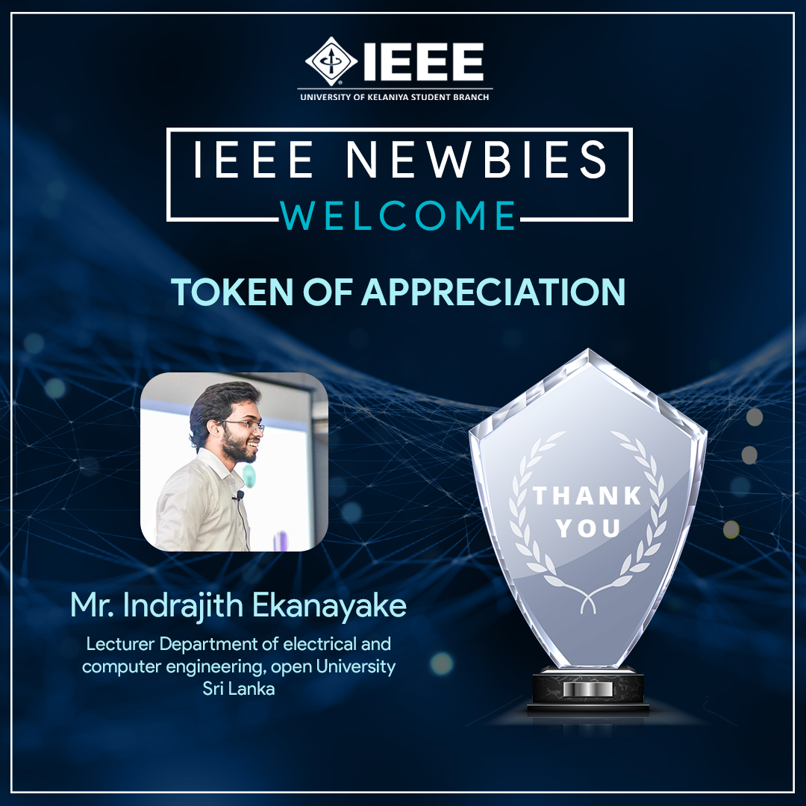

As the Sri Lanka Section lead for IEEEXtreme 15.0 I conducted an awareness session seris for competitive programming among IEEE Student Branches of <a href="http://univotec.ac.lk/" target="_blank">University of Vocational Technology</a>, <a href="https://www.ruh.ac.lk/index.php/en/" target="_blank">University of Ruhuna</a>, <a href="https://www.sjp.ac.lk/" target="_blank">University of Sri Jayawardenapura</a>, <a href="https://www.kln.ac.lk/" target="_blank">University of Kelaniya</a>, and <a href="https://www.seu.ac.lk/" target="_blank">Southeastern University  of Sri Lanka</a>.

**Event Photographs:**

  
   
  
  
   
  
  

