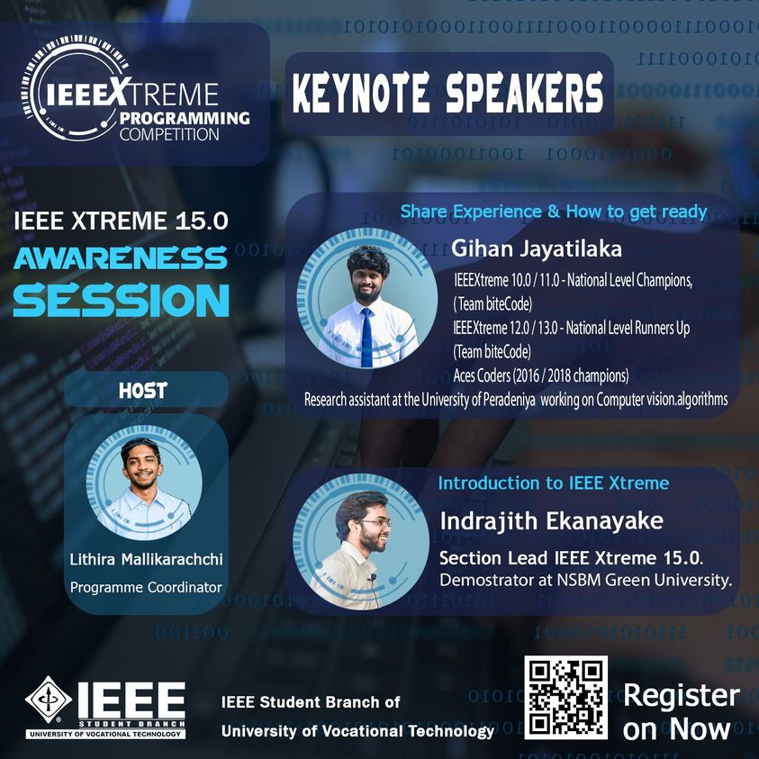
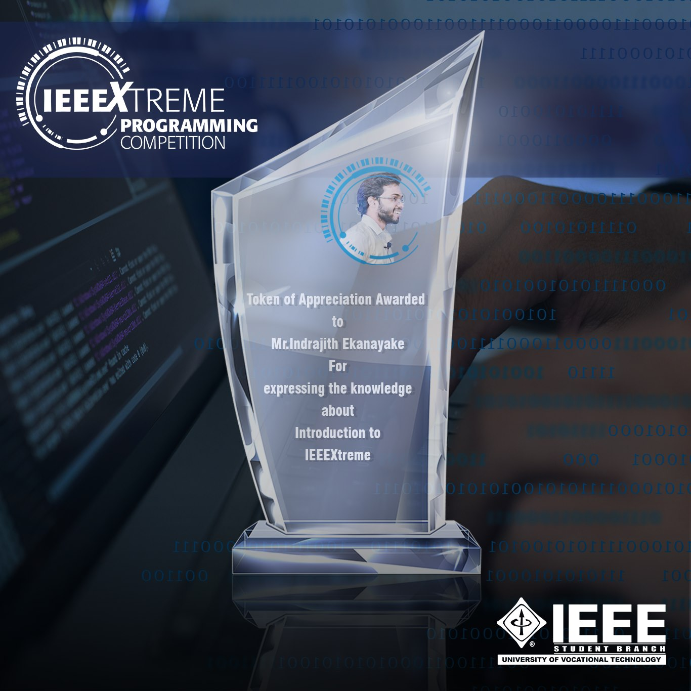
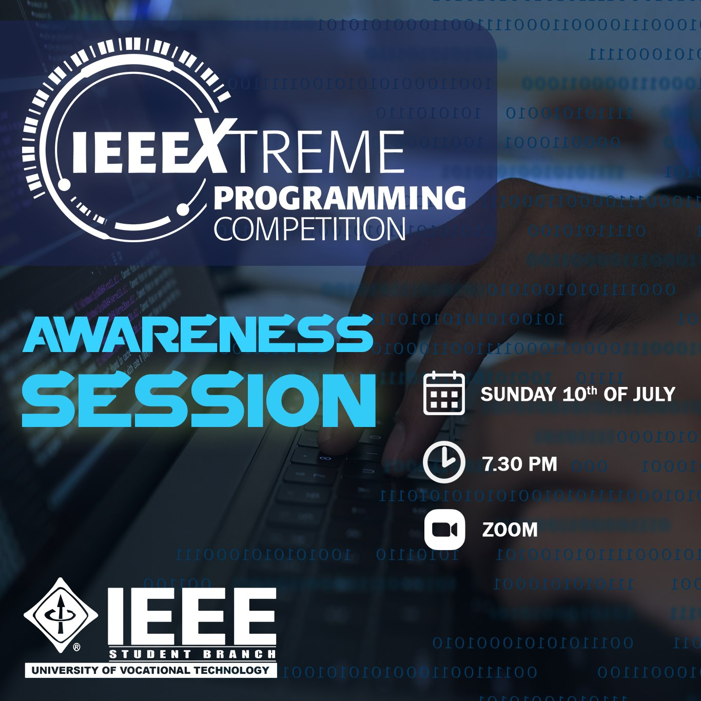
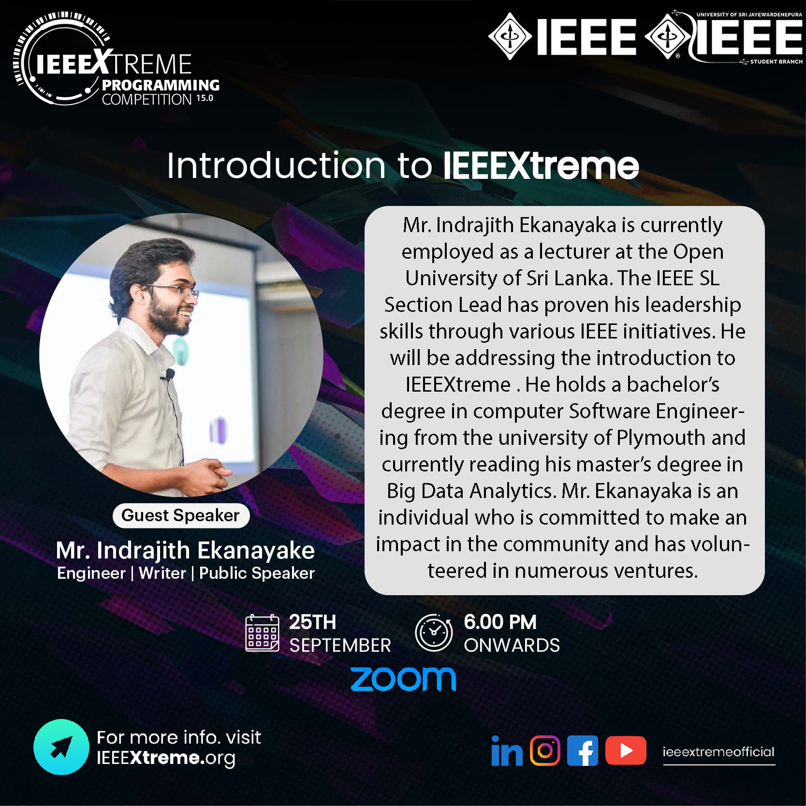

As the Sri Lanka Section lead for IEEEXtreme 15.0 I conducted awareness session seris for competitive programming among IEEE Student Branches of [University of Vocational Technology](http://univotec.ac.lk/), [University of Ruhuna](https://www.ruh.ac.lk/index.php/en/), [University of Sri Jayawardenapura](https://www.sjp.ac.lk/), [University of Kelaniya](https://www.kln.ac.lk/), and [Southeastern University  of Sri Lanka](https://www.seu.ac.lk/).

**Event Photographs:**

  
   
  
  
   
  
  

