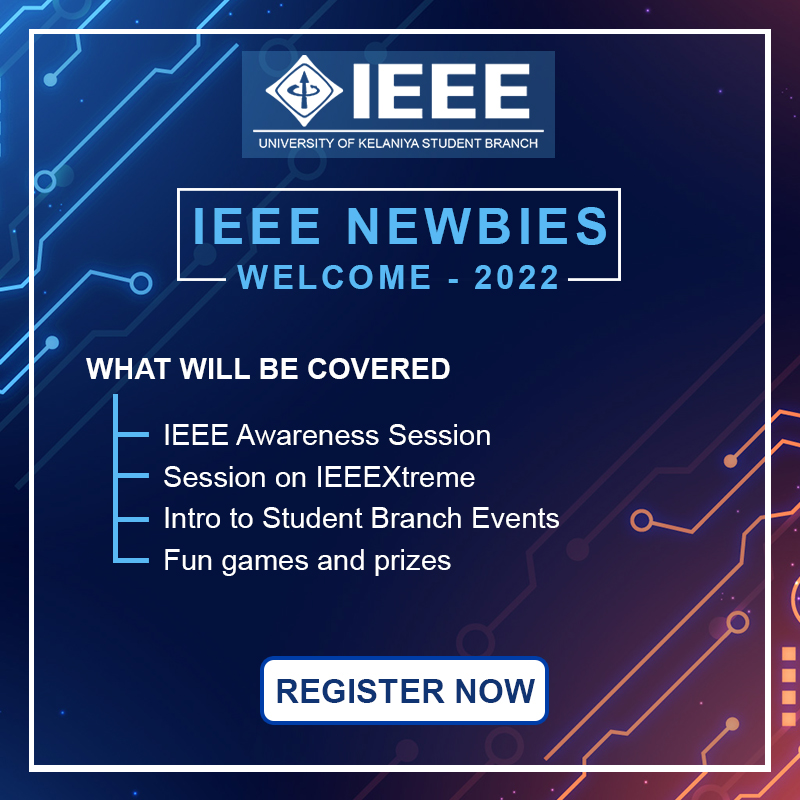
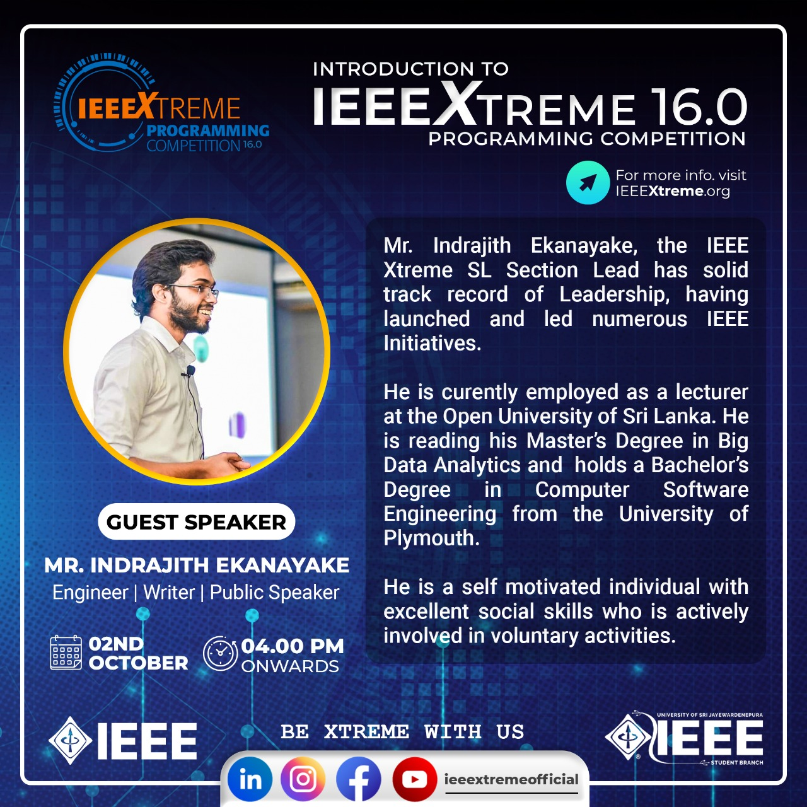

As the <a href="https://ieeextreme.org/ieeextreme-16-0-team/" target="_blank">Region 10 lead for IEEEXtreme 16.0</a> I conducted awareness session seris for competitive programming among IEEE Student Branches of <a href="https://www.sjp.ac.lk/" target="_blank">University of Sri Jayawardenapura</a>, <a href="https://www.kln.ac.lk/" target="_blank">University of Kelaniya</a>.

**Event Photographs:**

  
   
  

