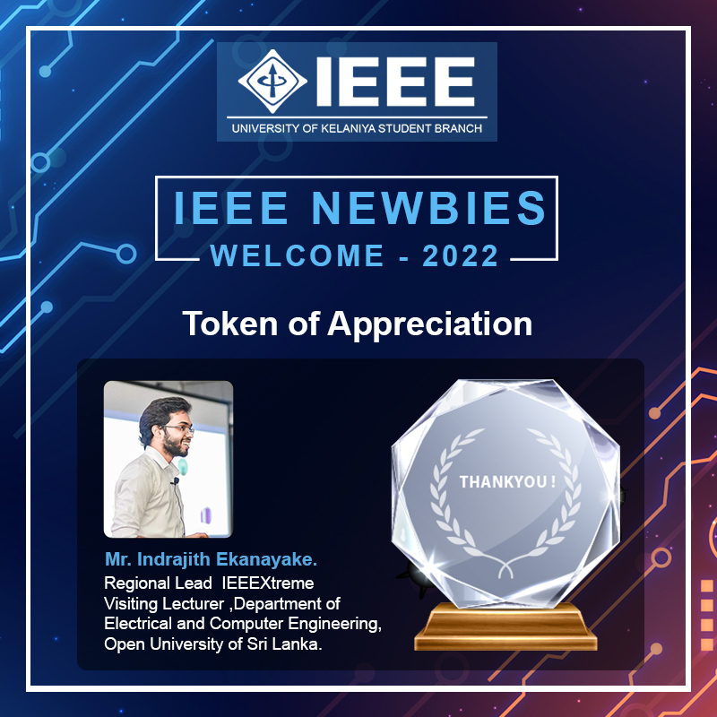

As the [Region 10 lead for IEEEXtreme 16.0](https://ieeextreme.org/ieeextreme-16-0-team/) I conducted awareness session seris for competitive programming among IEEE Student Branches of [University of Sri Jayawardenapura](https://www.sjp.ac.lk/), [University of Kelaniya](https://www.kln.ac.lk/).

Event Photographs:

  
   
  

