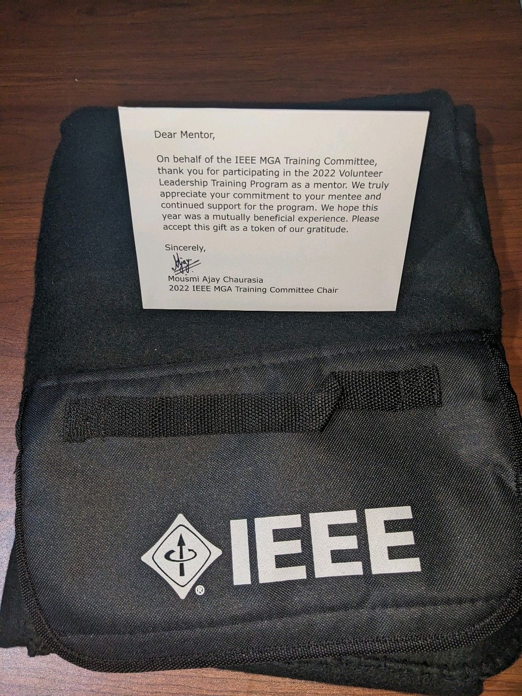

Mentored two student community leaders through IEEE VoLT organized by <a href="https://www.linkedin.com/company/ieee-member-and-geographic-activities/" target="_blank">IEEE Member and Geographic Activities</a>
  
If someone wants to take part in IEEE leadership I highly recommend the VoLT program and I will be a mentor coming years too.  
  
Thank you professor <a href="https://www.linkedin.com/in/mousmi-ajay-chaurasia-17a4a7188/" target="_blank">Mousmi Ajay Chaurasia</a> for sending this cool sleeping blanket

**Event Photographs:**

  

