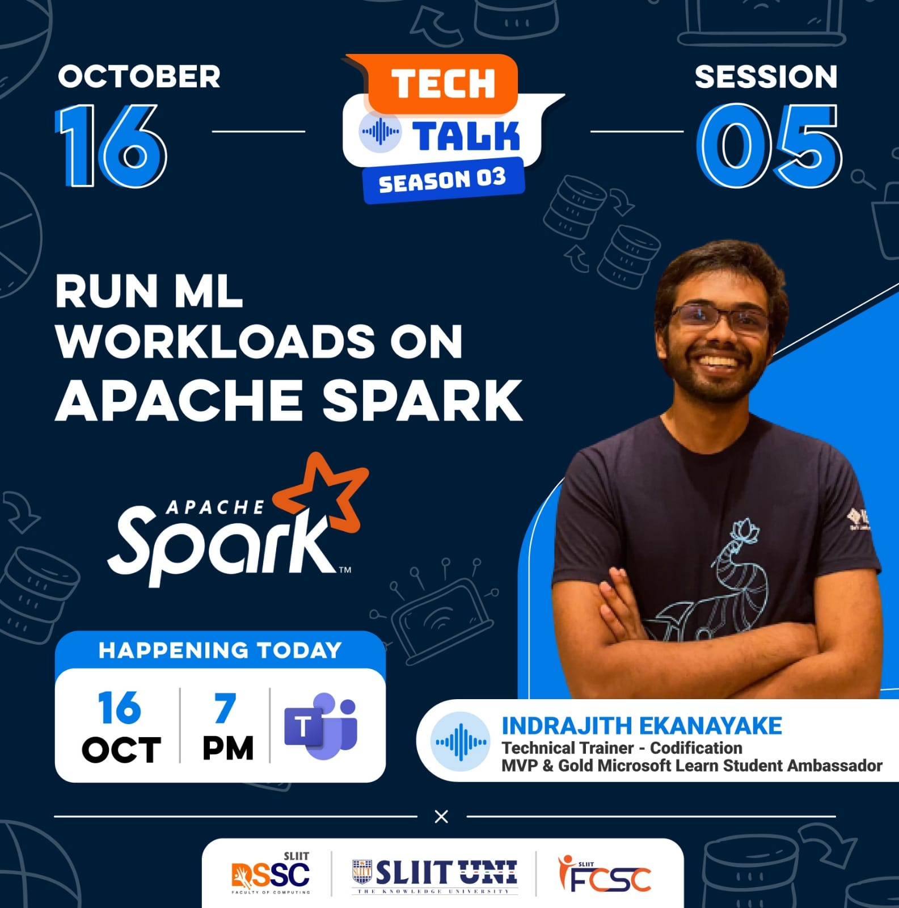

I received an invitation from the data science student community at the Sri Lanka Institute of Information Technology(SLIIT) for a session on Spark. In this session, the hands-on part was conducted using Databricks

**Event Slides:**
<iframe src="https://drive.google.com/file/d/1JLqbGC7UphSj_bxzc2uX9DnXPGRXlDkF/preview" width="640" height="480" allow="autoplay"></iframe>

**Event Photographs:**

  

