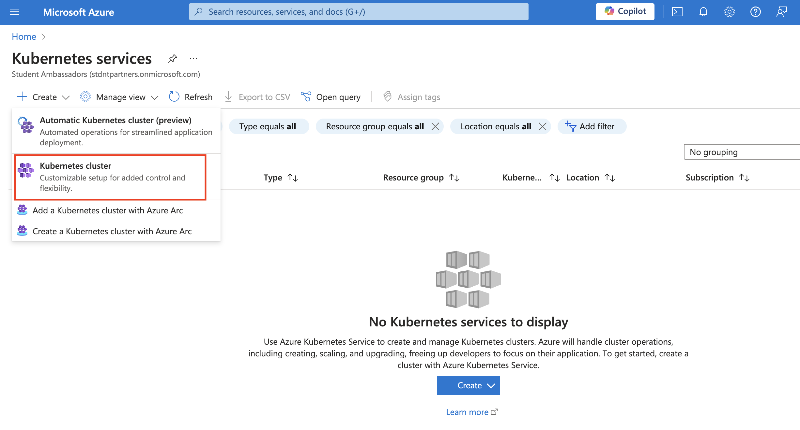
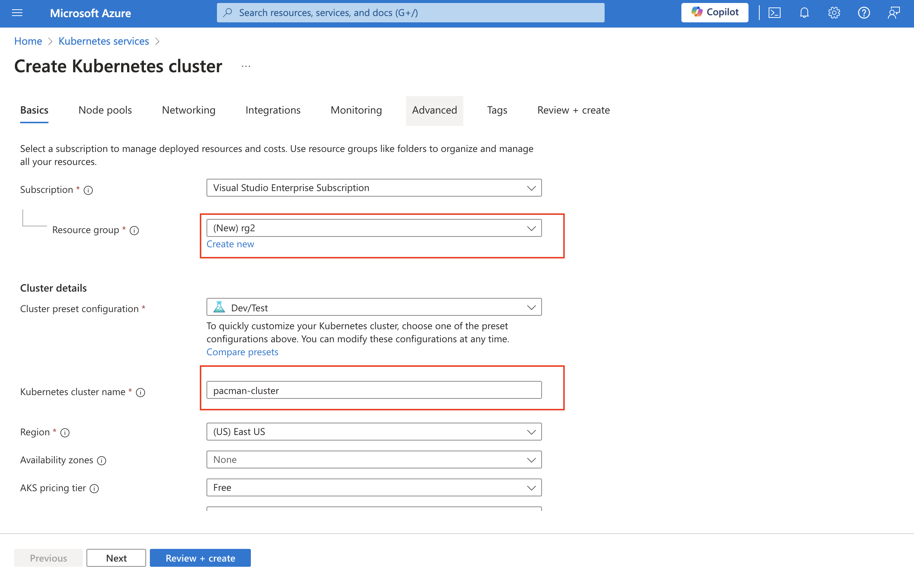
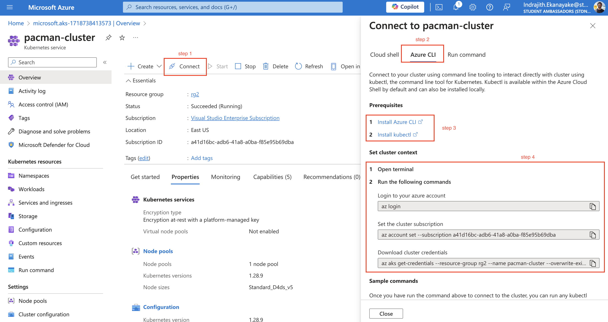
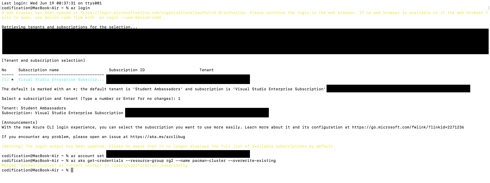
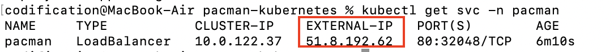

**Event Slides:**

*Request permission for the slides if required.*
<iframe src="https://drive.google.com/file/d/17RdTd2sWMZm8AAIAoZRHdBUF68ycsAkU/preview" width="640" height="480" allow="autoplay"></iframe>

#### Guide for the Demo part
Azure Kubernetes Service(AKS) is simply Kubernetes as a service. Azure abstracts the complexity of setting up a Kubernetes cluster by providing it as a service. With Azure, it's really simple to create a cluster which could take hours if you configure a cluster using the <a href="https://github.com/kelseyhightower/kubernetes-the-hard-way" target="_blank">hard way</a>.

**Set up AKS cluster:**

As a prerequisite, you need to have an Azure subscription. (If you are a student you can have <a href="https://azure.microsoft.com/en-us/free/students" target="_blank">100$ worth free Azure credits</a> for your university email.)

Once you log into the Azure portal, search for Kubernetes services and then click create new "Kubernetes Cluster"

To keep everything simple I'm going with the default settings. There you only need to give the resource group and cluster name. If you want to change other parameters you can refer to AKS documentation.

Hit "Review and create" and then "Create". It usually takes around 5/6 minutes to complete the deployment. 

**Deploy Microservice application:**

Now, the AKS cluster setup is completed. Next up we need to connect to the cluster using the terminal. I personally recommend Azure CLI than the cloud shell. For that, you can go to the AKS resource you just created, click connect, and select Azure CLI.

If you don't have Azure CLI installed in your machine you need to install it. For that, you can follow step 3 in the above image. Also, I'm using z shell in my Mac to run commands, if you are on Windows you probably need Windows subsystem for Linux(WSL2).

Once Azure CLI and Kubectl are installed in your machine you can connect to the cluster by running the commands in Step 4.


The next step is to deploy your microservice application into the cluster. Here I'm using a Pacman application with two microservices (i.e., frontend microservice, and MongoDB backend microservice). The frontend microservice docker image is already available in the public image repository.

As you have learned, we usually use a declarative approach with k8s to write YAML files to instruct how our microservices should get deployed. The YAML files are prewritten and available on GitHub. Next up I'm running several commands to clone my GitHub repo and apply the YAML files which we discussed detailedly in the session.

```shell
git clone https://github.com/indrajithekanayake/pacman-kubernetes
cd pacman-kubernetes
kubectl create ns pacman
kubectl apply -f services/pacman-service.yaml
kubectl apply -f services/mongo-service.yaml
kubectl apply -f security/secret.yaml
kubectl apply -f persistentvolumeclaim/mongo-pvc.yaml
kubectl apply -f deployments/pacman-deployment.yaml
kubectl apply -f deployments/mongo-deployment.yaml
```
I'm not gonna go deep and explain the commands again as I explained them in the session. It will take about 1 minute to get the two deployments running. You can check that by running the command `kubectl get deployments -n pacman`

Once the deployments are running you can check the public IP of loadbalancer service you created. To get the IP address Run
```shell
kubectl get svc -n pacman
```


Hope this demo guide will be helpful for someone to follow what we discussed in the session. Finally, at the end make sure to remove the resource group in the Azure portal to avoid any unnecessary billing.

**Event Photographs:**
<p>
  
</p>