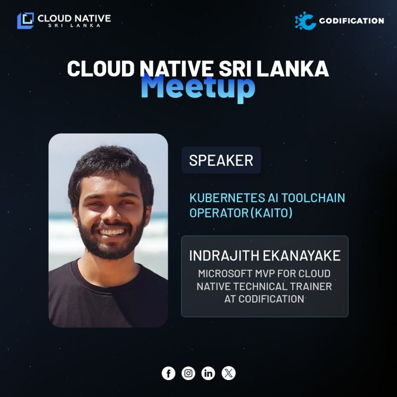
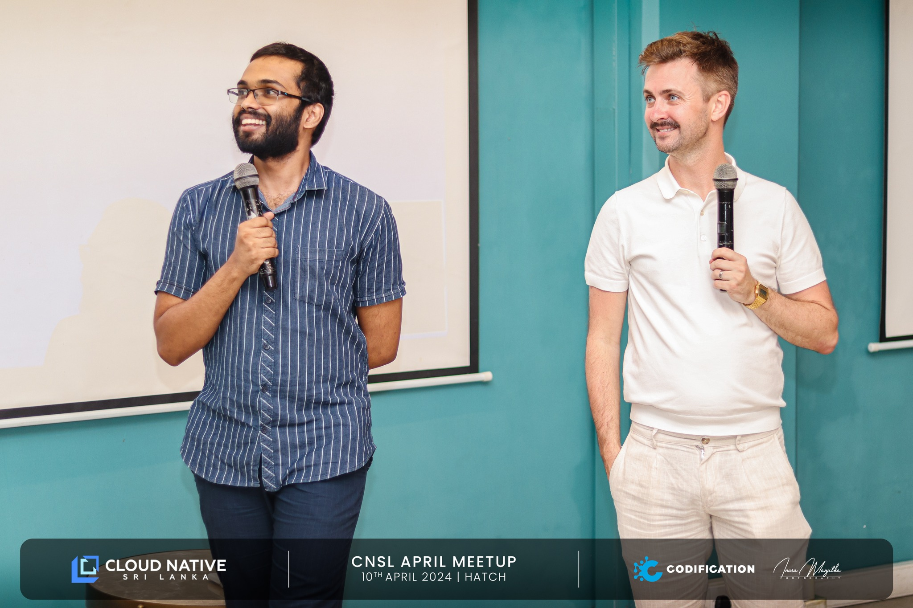
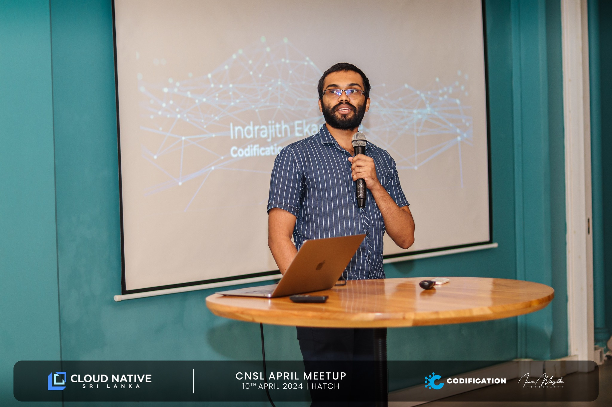

**Event Slides:**
<iframe src="https://drive.google.com/file/d/1NRdme8tXinFgUkqmeTEqnCYfOSIjF9wS/preview" width="640" height="480" allow="autoplay"></iframe>


#### Guide for the Demo part
<a href="https://github.com/Azure/kaito" target="_blank">Kaito</a> comes in handy when there are requirements to deploy production-grade inference models within the Kubernetes cluster. Currently, it focuses on open-source LLMs and it has model presents for falcon, llama2, mistral, and phi2 model families so far.

For Kaito as an operator, I identify 3 main use cases in my personal use but there are many more and many more to come,
1. When there is a requirement to have an inference model within the cluster Kaito can abstract the complexity of creating, autoscaling, and managing  GPU nodes. (using <a href="https://github.com/kubernetes-sigs/karpenter" target="_blank">Karpenter</a>  APIs)
2. Automatic tuning of model parameters to fit GPU hardware using the provided preset configurations.
3. Model weights are built into the image so if a pod goes down, we can easily bring a new pod using the already downloaded image from the node.

The above session had 2 components a 20-minute theory and a 20-minute demo. All the commands related to the demo session are mentioned below. (Basically, these commands were taken from Kaito documentation and slightly modified according to my environment)

**Prerequisites**
- Azure subscription
- Azure CLI
- Azure Developer CLI
- kubectl
- Helm
- Azure vCPU quota (for Kaito you are required to have 12 vCPUs in Standard NCSv3 family)

You may check the vCPU quota by,
```bash
az vm list-usage \
  --location ${AZURE_LOCATION} \
  --query "[? contains(localName, 'Standard NCSv3')]" \
  -o table
```

**Step 1: Azure Managed Identity for Kaito provisioner**
```bash
# set up the variables
export LOCATION="eastus"                                                      
export RESOURCE_GROUP="rg1"
export MY_CLUSTER="kaitoCluster"

# create resource group 
az group create --name $RESOURCE_GROUP --location $LOCATION

# create aks cluster (make sure to enable oidc-issuer while creating, if the cluster is already created you can enable this later as well)
az aks create --resource-group $RESOURCE_GROUP --name $MY_CLUSTER --node-count 2 --enable-oidc-issuer --enable-workload-identity --enable-managed-identity --generate-ssh-keys --network-plugin azure

az aks get-credentials --resource-group $RESOURCE_GROUP --name $MY_CLUSTER

# create a new managed identity that the Kaito operator will use
export IDENTITY_NAME="kaitoprovisioner"
az identity create --name $IDENTITY_NAME -g $RESOURCE_GROUP

# assign the managed identity the necessary permissions to provision GPU nodes for use within your AKS cluster. You need to assign contributor or higher role
export AZURE_AKS_CLUSTER_ID=$(az aks show --name $MY_CLUSTER --resource-group $RESOURCE_GROUP --query id -o tsv)

az role assignment create --assignee $KAITO_IDENTITY_PRINCIPAL_ID  --scope $AZURE_AKS_CLUSTER_ID  --role Contributor

# create a federated identity credential so that the Kaito provisioner managed identity can authenticate against Microsoft Entra ID from within the AKS cluster.
export SUBSCRIPTION=$(az account show --query id -o tsv)

export AKS_OIDC_ISSUER=$(az aks show -n $MY_CLUSTER -g $RESOURCE_GROUP --subscription $SUBSCRIPTION --query "oidcIssuerProfile.issuerUrl" -o tsv)

az identity federated-credential create --name kaito-federatedcredential --identity-name $IDENTITY_NAME -g $RESOURCE_GROUP --issuer $AKS_OIDC_ISSUER --subject system:serviceaccount:"gpu-provisioner:gpu-provisioner" --audience api://AzureADTokenExchange --subscription $SUBSCRIPTION
```

**Step 2: Installing the Kaito Operator**
```bash
# add the helm repo
helm repo add kaito https://azure.github.io/kaito/charts/kaito

# install Kaito GPU provisioner controller
export NODE_RESOURCE_GROUP=$(az aks show -n $MY_CLUSTER -g $RESOURCE_GROUP --query nodeResourceGroup -o tsv)

export TENANT_ID=$(az account show --query tenantId -o tsv)

cat << EOF > gpu-provisioner-values.yaml
controller:
  env:
  - name: ARM_SUBSCRIPTION_ID
    value: $SUBSCRIPTION
  - name: LOCATION
    value: $LOCATION
  - name: AZURE_CLUSTER_NAME
    value: $MY_CLUSTER
  - name: AZURE_NODE_RESOURCE_GROUP
    value: $NODE_RESOURCE_GROUP
  - name: ARM_RESOURCE_GROUP
    value: $RESOURCE_GROUP
  - name: LEADER_ELECT
    value: "false"
workloadIdentity:
  clientId: $KAITO_IDENTITY_CLIENT_ID
  tenantId: $TENANT_ID
settings:
  azure:
    clusterName: $MY_CLUSTER
EOF

helm install gpu-provisioner kaito/gpu-provisioner -f gpu-provisioner-values.yaml

# install Kaito workspace controller
helm install workspace kaito/workspace

# check the workspace CR
kubectl api-resources | grep kaito
kubectl explain workspace
```

**Step 3: Create a Kaito preset workspace**
```bash
# here we are using falcon-7b-instruct model preset available in Kaito
kubectl apply -f - <<EOF
apiVersion: kaito.sh/v1alpha1
kind: Workspace
metadata:
  name: workspace-falcon-7b-instruct
  annotations:
    kaito.sh/enablelb: "False"
resource:
  count: 1
  instanceType: "Standard_NC12s_v3"
  labelSelector:
    matchLabels:
      apps: falcon-7b-instruct
inference:
  preset:
    name: "falcon-7b-instruct"
EOF

kubectl describe workspace workspace-falcon-7b-instruct

# it will approximately take 15-20minutes to create workspace, it takes time to provision GPUs
kubectl get workspace workspace-falcon-7b-instruct -w
```

**Step 4: Test the falcon-7b-instruct workspace inference endpoint**
```bash
#earliyer when we are creating workspace CR we set the loadbalencer annotation to false so here we are using clusterip service to connect cluster hosted falcon-7b-instruct model for inferencing.
kubectl run -it --rm --restart=Never curl --image=curlimages/curl -- curl -X POST http://workspace-falcon-7b-instruct/chat -H "accept: application/json" -H "Content-Type: application/json" -d "{\"prompt\":\"What is Kaito?\"}"
```

That's the end of the demo, thanks for showing up at the cloud-native Sri Lanka event and I hope to do more interesting sessions in future meetups.  

**Event Photographs:**
<p>
  
   
   
   
</p>