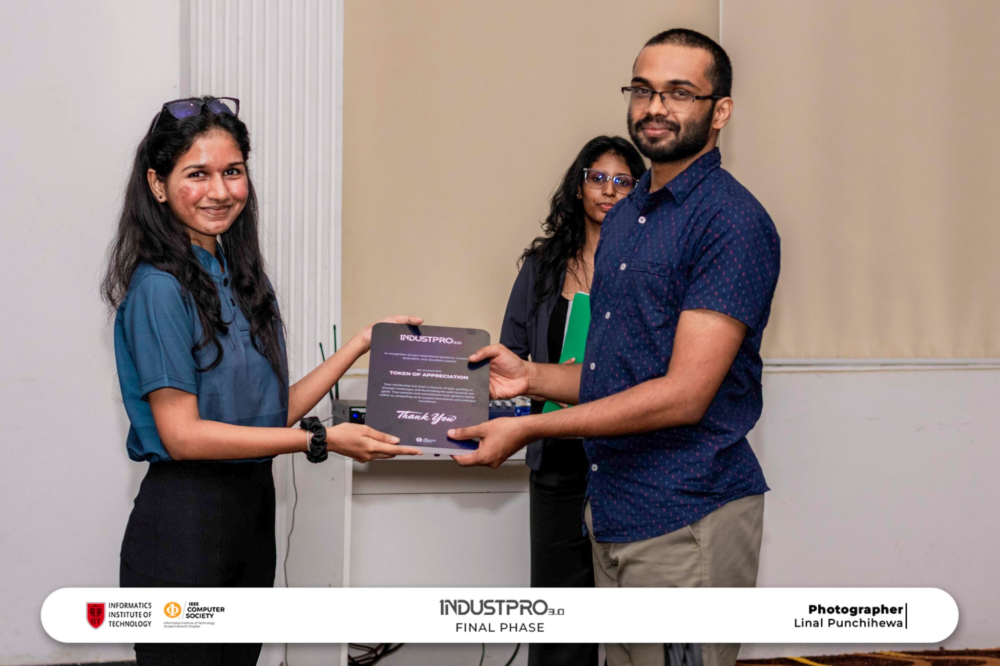
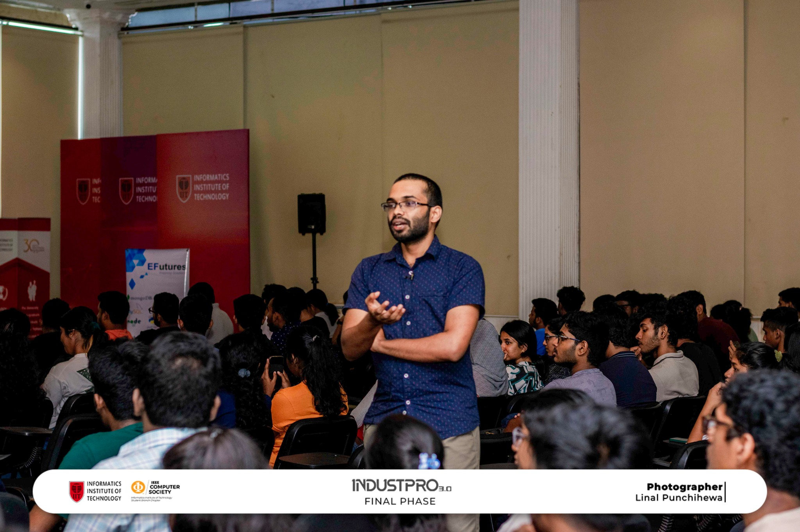

I was invited as a speaker for the Final Phase of IndustPro 3.0, organized by the IEEE Computer Society Student Branch Chapter of IIT* to enhance undergraduate students' professional skills.

Time Duration: 30 - 45 minutes (12:30 PM - 1:15 PM)

<iframe src="https://drive.google.com/file/d/1DJRJugveVRkvx7LIR65L3FAk9WUueysL/preview" width="640" height="480" allow="autoplay"></iframe>

**Event Photographs:**

  
   

 * location: "GP Square Auditorium, IIT, Sri Lanka