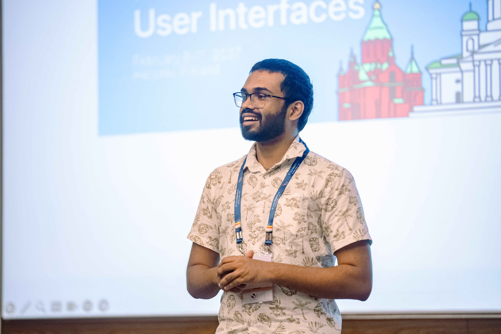
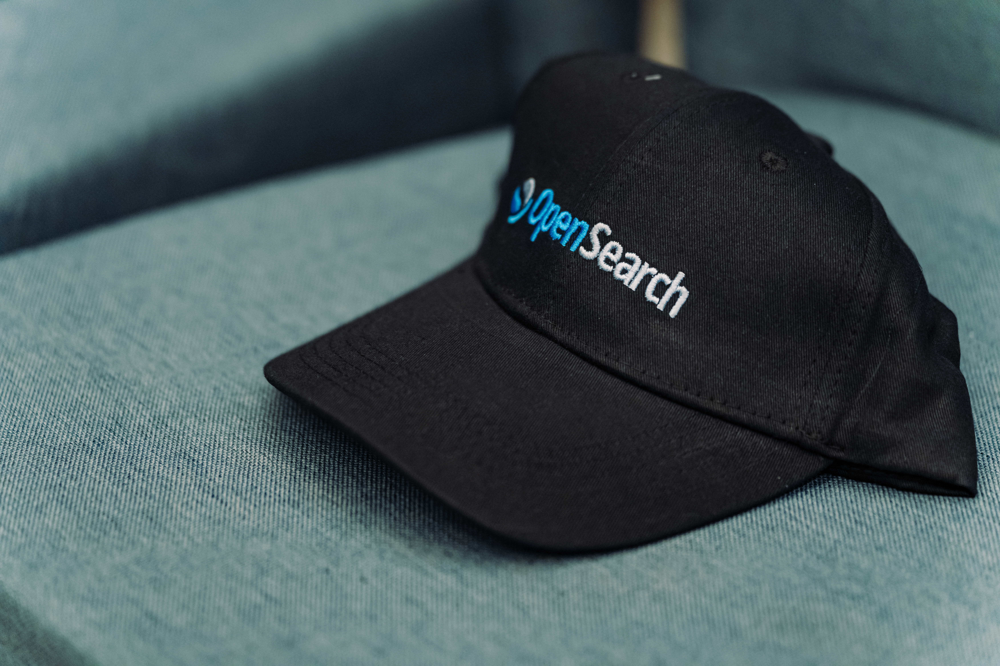

This session was about the recent productivity study we ran in our open source lab (OSL). I walked through the end-to-end architecture: extracting device telemetry, transforming it into task sessions, and running association rule mining on top of OpenSearch to compute support and confidence for goal-relevant activity patterns. The entire setup runs locally, therefore no risk of activity data theft.  
  
ActivityWatch is a cross-platform open-source time tracker that collects telemetry on how we spend time on devices. It comes with watchers that can do all the data collection from AFK to browser windows. In our setup, ActivityWatch runs on each device, and OpenSearch is self-hosted on our research lab’s local LAN, and then we ingest logs into it every 10 seconds using API-based ingestion. While ActivityWatch runs, users tag their intended task (e.g., #learn, #java). We align tags with telemetry windows, sessionize events into transactions (items[]=apps/domains, duration), and mine rules with support/confidence/lift per tag. If the current window drifts from the active tag with high confidence for a short period, we send a nudge reminding they are distracted from the original goal.

**Event Slides:**

<iframe src="https://drive.google.com/file/d/1AJ3wYXHaWZvKcE4Fk6adqmCH_3Dh4mOz/preview" width="640" height="480"></iframe>
**Event Photographs:**

  
   

 * location: Jio World Convention Centre, Mumbai, India

